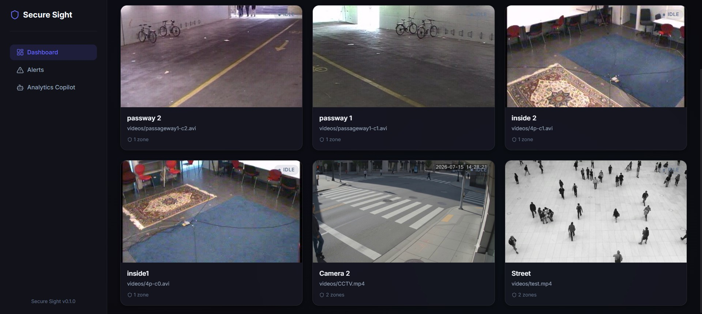
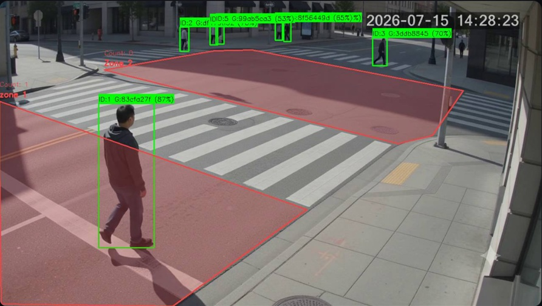
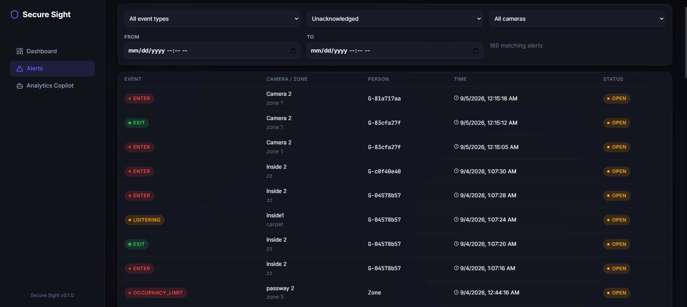
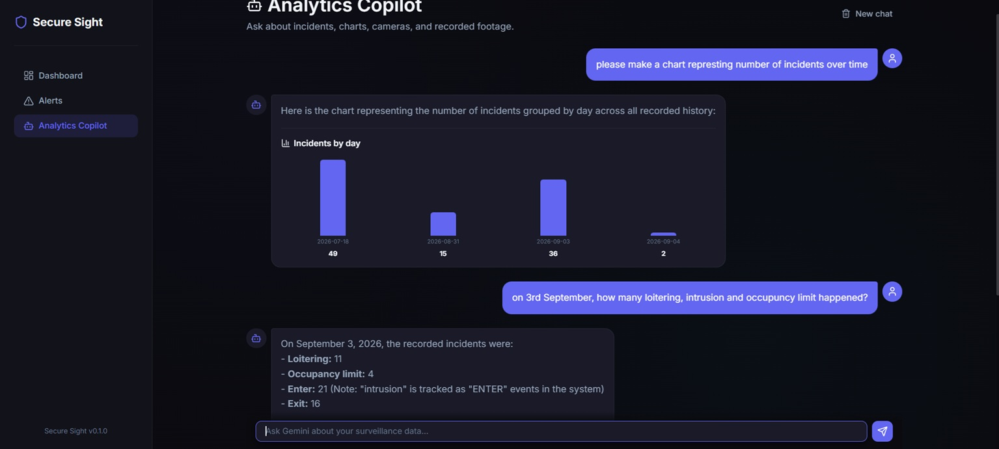

# Secure Sight — Zone-Based Multi-Camera Surveillance Analytics

Secure Sight is a real-time, multi-camera video analytics platform. Each
camera runs an independent pipeline that detects people (YOLOv8), tracks
them within the camera (ByteTrack), links their anonymous identity across
overlapping cameras (OSNet appearance embeddings), and evaluates them
against operator-drawn polygon zones under one of three configurable
rules — **intrusion**, **loitering**, and **occupancy limit**. Triggered
incidents are persisted with a snapshot and a short video clip, reviewable
and acknowledgeable from a web dashboard, and queryable in plain language
through a read-only Analytics Copilot.

The system is domain-agnostic — it was originally prototyped for school
corridors, but nothing in the pipeline is school-specific. It applies
equally to offices, retail floors, warehouses, and campuses. A full
technical writeup — architecture, exact operating parameters, and a
comparison against similar systems — is in
[`SecureSight_manuscript.pdf`](SecureSight_manuscript.pdf).

## Screenshots

| Live camera wall | Zone-annotated detail view |
|---|---|
|  |  |

| Alert queue | Analytics Copilot |
|---|---|
|  |  |

## Features

- **Multi-camera detection & tracking** — one independent pipeline per
  camera (file, RTSP/HTTP, or webcam source), YOLOv8 person detection,
  ByteTrack within-camera identity.
- **Anonymous cross-camera identity** — OSNet appearance embeddings link
  the same person across overlapping cameras with a random, session-scoped
  UUID (no face recognition, no name linkage).
- **Three zone rule types per polygon** — immediate intrusion
  (enter/exit), threshold-gated loitering (dwell time), and occupancy
  limit (headcount threshold with cooldown).
- **Live dashboard** — a camera wall with live annotated feeds and status,
  plus a per-camera detail view with draggable zone vertices and rule
  configuration.
- **Incident review** — every triggered alert gets a JPEG snapshot and an
  auto-assembled 10-second clip (5 s before/after), an acknowledge/reopen
  workflow with operator notes, and REST-backed filtering by type, camera,
  date, and acknowledgement state.
- **Analytics Copilot** — an optional natural-language chat over incident
  history (Gemini function-calling with a guarded, read-only SQL tool);
  never executes writes and never sees raw file paths.
- **Hot-reloadable zones** — create, delete, reshape, or change a zone's
  rule without restarting the camera's pipeline.

## Requirements

- **Python 3.10+** and **Node.js 18+**
- **ffmpeg** on `PATH` — required to transcode incident clips to MP4;
  without it, clip generation fails silently and only snapshots are saved
- A **CUDA-capable GPU** is recommended (detection and ReID both default
  to `cuda`); set `DETECTION_DEVICE=cpu` and `REID_DEVICE=cpu` to run on
  CPU instead
- A **Gemini API key** — only needed to enable the Analytics Copilot

## Quick Start

### Backend

```bash
cd backend
pip install -r requirements.txt
python run.py
```

The server starts at `http://localhost:5000` (REST API at `/api/v1`).
YOLOv8 weights (`yolov8s.pt`) download automatically on first run via
Ultralytics; OSNet ReID weights are bundled under `backend/models/`.

To enable the Analytics Copilot, copy `backend/.env.example` to
`backend/.env` and set `GEMINI_API_KEY`. The key stays on the backend —
the frontend only ever calls the local Copilot endpoint. Without a key,
every other feature works normally and the Copilot page returns a clear
"not configured" error.

### Frontend

```bash
cd frontend
npm install
npm run dev
```

Opens at `http://localhost:5173`. Override the backend location with
`VITE_API_URL` and `VITE_SOCKET_URL` (both default to
`http://localhost:5000`).

### Try it without real cameras

The `videos/` folder ships sample clips (including the EPFL Laboratory
multi-camera sequence and a generic CCTV clip) you can point a camera at
directly, e.g. `source_uri: "videos/4p-c0.avi"`, `source_type: "file"`.

## Configuration reference

All variables are optional; defaults are shown. Set them in
`backend/.env` (loaded automatically by `run.py`).

| Variable | Default | Purpose |
|---|---|---|
| `FLASK_DEBUG` | `true` | Flask debug mode |
| `SECRET_KEY` | dev placeholder | Flask session secret — set a real value before any shared deployment |
| `HOST` / `PORT` | `0.0.0.0` / `5000` | Bind address |
| `YOLO_MODEL` | `yolov8s.pt` | Ultralytics model path/name |
| `DETECTION_CONFIDENCE` | `0.5` | Minimum detector confidence |
| `DETECTION_DEVICE` | `cuda` | `cuda`, `cpu`, or a device index |
| `TRACKER_LOST_SECONDS` | `4.0` | How long ByteTrack keeps a lost track alive |
| `TRACKER_MATCHING_THRESHOLD` | `0.7` | ByteTrack IoU matching threshold |
| `GLOBAL_IDENTITY_ENABLED` | `true` | Enable cross-camera identity resolution |
| `GLOBAL_IDENTITY_WINDOW_SECONDS` | `3.0` | Cross-camera candidate time window |
| `REID_ENABLED` | `true` | OSNet is required; `false` fails startup |
| `REID_MODEL_PATH` | `models/osnet_x1_0_msmt17.pth` | ReID checkpoint |
| `REID_SIMILARITY_THRESHOLD` | `0.70` | Cosine similarity merge threshold |
| `REID_MIN_CROP_HEIGHT` | `64` | Minimum person crop height (px) to embed |
| `REID_SAMPLE_INTERVAL_FRAMES` | `5` | Embed every Nth processed frame |
| `REID_DEVICE` | same as `DETECTION_DEVICE` | ReID inference device |
| `STREAM_QUALITY` | `70` | JPEG quality for the live stream |
| `STREAM_MAX_FPS` | `30` | Cap on processed/streamed frame rate |
| `GEMINI_API_KEY` | *(unset)* | Enables the Analytics Copilot when set |
| `GEMINI_MODEL` | `gemini-3.5-flash-lite` | Gemini model used by the Copilot |

Frontend (`frontend/.env`): `VITE_API_URL`, `VITE_SOCKET_URL`.

## Zone rules

Every zone has exactly one `rule_type`, set on creation via
`POST /api/v1/cameras/{camera_id}/zones`:

```jsonc
// Intrusion — alert on every enter/exit
{ "name": "Restricted door", "rule_type": "intrusion",
  "polygon_points": [[0.1,0.1],[0.4,0.1],[0.4,0.4],[0.1,0.4]] }

// Loitering — alert once after a continuous stay past the threshold
{ "name": "Waiting area", "rule_type": "loitering",
  "dwell_threshold_seconds": 60, "alert_cooldown_seconds": 60,
  "polygon_points": [[0.5,0.1],[0.9,0.1],[0.9,0.5],[0.5,0.5]] }

// Occupancy limit — alert when headcount exceeds the limit, re-arms below it
{ "name": "Loading bay", "rule_type": "occupancy_limit",
  "occupancy_limit": 3, "alert_cooldown_seconds": 60,
  "polygon_points": [[0.1,0.6],[0.9,0.6],[0.9,0.95],[0.1,0.95]] }
```

`polygon_points` are normalized `[x, y]` coordinates in `[0, 1]`, at least
3 vertices. Existing zones can be reshaped by dragging vertices in the
camera detail view (while the pipeline is stopped), or updated directly
via `PUT /api/v1/zones/{zone_id}`.

## Cross-camera identity

Every tracked person gets a camera-local ByteTrack ID and an anonymous
`global_person_id`. Cross-camera linking is appearance-only (OSNet cosine
similarity); it does not use geometry. `overlap_group` and
`ground_plane_homography` can be stored per camera via `PUT
/api/v1/cameras/{camera_id}`, but they are metadata only — the active
matcher does not currently consult them:

```json
{
  "overlap_group": "main-courtyard",
  "ground_plane_homography": [[0.01,0.0,-2.4],[0.0,0.01,-1.1],[0.0,0.0,1.0]]
}
```

## Analytics Copilot

With `GEMINI_API_KEY` set, the "Analytics Copilot" page answers questions
about incident history — e.g. *"show the latest loitering footage"* or
*"chart incidents by day this month"*. It can look up incidents, build a
bar/line/pie chart, resolve a camera name to an ID, or run one read-only,
row-capped SQL query over `alerts`/`cameras`/`zones` for anything the
other tools can't answer. It never receives database credentials, never
executes a write, and never sees a raw file path (clip/snapshot files are
only ever exposed as served URLs).

## REST API

Base URL: `/api/v1`.

| Resource | Endpoints |
|---|---|
| Cameras | `GET/POST /cameras` · `GET/PUT/DELETE /cameras/{id}` · `POST /cameras/{id}/start` · `POST /cameras/{id}/stop` · `GET /cameras/{id}/thumbnail` |
| Zones | `GET/POST /cameras/{camera_id}/zones` · `GET/PUT/DELETE /zones/{id}` |
| Alerts | `GET /alerts` (filters: `camera_id`, `zone_id`, `event_type`, `start_time`, `end_time`, `acknowledged`, `page`, `per_page`) · `GET /alerts/recent` · `GET /alerts/{id}` · `PUT /alerts/{id}/acknowledge` · `GET /alerts/{id}/snapshot` · `GET /alerts/{id}/clip` |
| Copilot | `POST /copilot/chat` |

Real-time updates are delivered over Socket.IO: the `/stream` namespace
(join a camera's room for its live annotated frames) and the `/alerts`
namespace (broadcasts every zone event as it happens).

## Testing

```bash
cd backend
pytest
```

Covers tracker/ReID configuration, cross-camera identity merge logic, and
additive SQLite migrations. It does not exercise real model inference,
the live pipeline, or the REST/Socket.IO API end to end — see the paper's
verification-status section for the full scope.

## Project structure

```
SecureSight/
├── backend/
│   ├── app/
│   │   ├── api/v1/        # REST endpoints: cameras, zones, alerts, copilot
│   │   ├── core/          # Detector, tracker, ReID, global identity, zone analyzer, pipeline
│   │   ├── services/      # Pipeline lifecycle, alerts, incident clips, copilot
│   │   ├── models/        # SQLAlchemy ORM (Camera, Zone, Alert)
│   │   ├── schemas/       # Pydantic request/response DTOs
│   │   ├── repositories/  # Data access layer
│   │   └── sockets/       # Socket.IO event handlers
│   ├── models/            # Bundled OSNet ReID checkpoints
│   └── tests/
├── frontend/
│   └── src/
│       ├── api/           # REST client
│       ├── pages/         # Dashboard, camera detail, alerts, copilot
│       ├── store/         # Zustand state
│       └── hooks/         # Socket.IO hooks
├── videos/                # Sample footage for local testing
├── figures/               # Screenshots used in this README and the paper
└── SecureSight_manuscript.tex / .pdf   # Technical paper
```

## Notes

- This is a development server (`FLASK_DEBUG=true` by default, no
  authentication on the API, sockets, or Copilot endpoint). Add
  authentication and set a real `SECRET_KEY` before exposing it beyond
  `localhost`.
- Global identities live in memory only — they reset when a camera's
  pipeline stops and do not persist across a backend restart.
